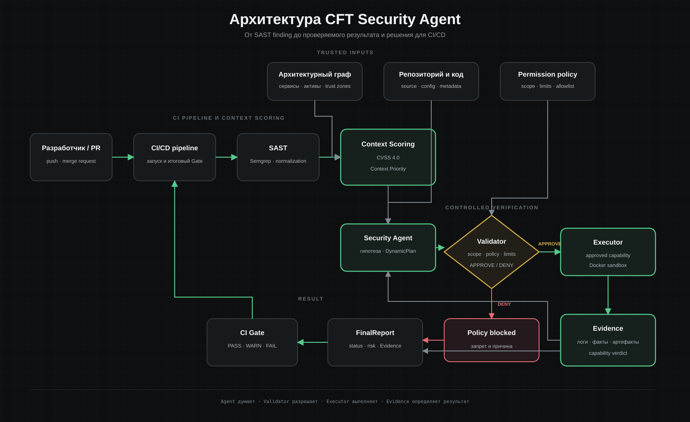
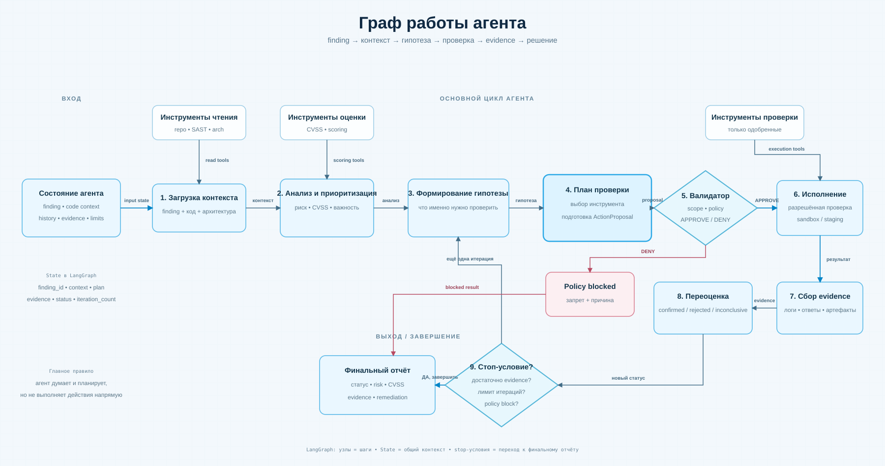

<div align="center">

# CFT Security Agent

### ИИ-агент для анализа, приоритизации и контролируемой проверки уязвимостей в CI/CD

`SAST` · `CVSS 4.0` · `LangGraph` · `AgentState` · `Validator` · `Executor`

</div>

---

## Зачем нужен проект

Обычный SAST умеет находить подозрительные места в коде, но не всегда понимает, **насколько находка важна именно для конкретной системы** и действительно ли она воспроизводится.

Этот проект строит следующий слой поверх SAST:

1. получает finding;
2. добавляет контекст кода и архитектуры;
3. оценивает техническую серьёзность через `CVSS 4.0`;
4. отдельно считает контекстный приоритет;
5. передаёт находку агенту;
6. агент формирует гипотезу и предлагает безопасную проверку;
7. `Validator` решает, разрешена ли она;
8. `Executor` выполняет только заранее разрешённое действие;
9. результат превращается в доказательство;
10. формируется финальный отчёт и статус для CI/CD.

> **Агент думает. Валидатор разрешает. Исполнитель выполняет. Результат подтверждается доказательствами.**

---

## Архитектура

Диаграмма ниже повторяет текущую архитектуру **Miro v0.5** по блокам и связям.

<p align="center">
  
</p>

### Два этапа системы

**Этап 1. Контекстная оценка**

`SAST`-находка дополняется информацией об архитектуре. На выходе получаем техническую оценку `CVSS` и отдельный контекстный приоритет.

**Этап 2. Агентная проверка**

Агент анализирует находку и предлагает проверку. Она не выполняется напрямую: сначала проходит через `Validator`, после чего `Executor` может запустить только разрешённое действие в согласованной тестовой среде.

---

## Как работает агент

Диаграмма повторяет **«Граф работы агента» из Miro v0.1**.

<p align="center">
  
</p>

В коде этот процесс реализован через `LangGraph` и общий `AgentState`.

Главные ветки:

```text
APPROVE → Executor → Evidence → переоценка
DENY    → policy_blocked → финальный отчёт
```

Если доказательств недостаточно, граф может сделать ещё одну итерацию, но только до заданного лимита.

---

## Что уже работает

| Компонент | Состояние |
|---|---|
| Структура репозитория и общие схемы | ✅ готово |
| `AgentState` | ✅ готово |
| Граф на `LangGraph` | ✅ готово |
| Ветки `APPROVE` / `DENY` | ✅ готово |
| Цикл с ограничением итераций | ✅ готово |
| Системный промпт агента | ✅ готово |
| `AgentReasoningModel` | ✅ готово |
| Детерминированная модель для тестов | ✅ готово |
| Multi-provider LLM fallback adapter | ✅ готово |
| Детерминированный `Validator` / permission policy v0.1 | ✅ готово |
| Формальные tool contracts v0.1 | ✅ готово |
| Ограниченный `Executor` с sandbox, approval, audit и evidence | ✅ готово |
| `Evidence` и `FinalReport` | ✅ базовая реализация |
| SberLab как Target v1 | ✅ зафиксирован |
| Context Priority v0.1 на реальной архитектуре | ✅ готово |
| CVSS applicability для первого E2E finding | ✅ `N/A` без ложного numeric score |
| Универсальный numeric CVSS 4.0 calculator | ⏳ после явных metric inputs |
| Безопасные health/API-проверки SberLab | ✅ готовы в Executor |
| Реальные Finding/Code/Architecture inputs для E2E | ✅ foundation v0.1 |
| Capability-specific Evidence verdict для backend Dockerfile finding | ✅ source-check v0.1 |
| Первый deterministic end-to-end сценарий | ✅ backend Dockerfile missing USER |

---

## Быстрый запуск

Требуется Python `3.11+`.

```bash
python3 -m venv .venv
source .venv/bin/activate
python3 -m pip install -e ".[dev]"
python3 -m pytest -q
```

Для текущего состояния проекта полный тестовый набор должен завершаться без ошибок.

Контракты tools можно отдельно проверить и вывести как JSON Schema:

```bash
python3 -m app.tool_contracts
python3 -m pytest -q tests/test_tool_contracts.py
```

Real E2E foundation можно запустить на нормализованном SAST finding:

```bash
python3 -m app.e2e_demo --findings reports/sast/findings.json --target ../sberlab_hack --index 0
```

Для четырёх текущих SberLab findings теперь используется небольшой reusable-каталог
verification capabilities: один Dockerfile USER inspector покрывает backend и frontend,
отдельный Python AST inspector проверяет password-assignment semantics, а bounded React
source-flow inspector проверяет опасный HTML sink без активного browser payload. Все source
paths берутся только из trusted artifact registry в `targets/sberlab.yaml`. Execution success
сам по себе по-прежнему не является verdict. Подробнее: [`docs/security-tools.md`](docs/security-tools.md).

Ручной тест графа:

```bash
python3 -m app.main
```

Пример результата теперь формируется из стабильного `FinalReport v1.0` и показывает finding,
выбранный capability, решение Validator, Evidence, CVSS/context priority, ограничения проверки и
следующий шаг. Тот же отчёт можно сохранить как JSON для CI/CD или будущего UI:

```bash
python -m app.e2e_demo ... --report-json artifacts/reports/finding-0.json
```

Подробнее: [`docs/reporting.md`](docs/reporting.md).

Предупреждение `LangChainPendingDeprecationWarning` от текущей версии LangGraph не означает падение теста.

### Проверка Executor на локальном SberLab

Сначала поднимите SberLab target и убедитесь, что его backend доступен на
`http://127.0.0.1:8000`. Затем выполните:

```bash
python3 -m app.executor_demo
```

Executor сформирует только заранее заданный `GET /health/`, вернёт
структурированный `ExecutionResult`, сохранит JSON evidence в
`executor_data/evidence/` и audit-событие в
`executor_data/audit/executor.jsonl`.
Другой адрес можно задать только через доверенную конфигурацию процесса:

```bash
CFT_TARGET_BASE_URL=http://127.0.0.1:8000 python3 -m app.executor_demo
```

---

## Структура репозитория

```text
cft-security-agent/
├── app/                  # конфигурация и точка запуска
├── agent/                # LangGraph, nodes, модель и prompt
├── schemas/              # общие типизированные контракты
├── architecture/         # получение архитектурного контекста
├── sast/                 # нормализация SAST-находок
├── scoring/              # CVSS и контекстный приоритет
├── validator/            # policy gate
├── executor/             # выполнение разрешённых действий
├── evidence/             # хранение доказательств
├── tools/                # контракты инструментов
├── policies/             # правила разрешений
├── targets/              # описание SberLab
├── docs/
│   └── diagrams/         # диаграммы README
└── tests/
```

---

## Ключевые модели

Компоненты общаются через единые структуры:

```text
Finding
ArchitectureContext
CVSSResult
ContextPriority
AnalysisResult
Hypothesis
ActionProposal
ValidationResult
ExecutionResult
Evidence
ReevaluationResult
FinalReport
AgentState
```

Это позволяет Лёхе, Роме, Кириллу и агентной части работать независимо, а потом соединять модули без переписывания интерфейсов.

---

## Разделение ответственности

### Агент

Агент может анализировать входные данные, формировать гипотезу, выбирать зарегистрированную возможность проверки и создавать `ActionProposal`.

Агент **не выполняет действие сам**.

### Validator

`Validator` работает как детерминированный policy gate. Текущие правила описаны в [`docs/validator.md`](docs/validator.md).

`Validator` проверяет:

- разрешён ли target;
- разрешён ли инструмент;
- допустима ли среда;
- соблюдён ли scope;
- не превышены ли лимиты;
- заполнены ли обязательные параметры.

### Executor

`Executor` принимает только уже одобренный `ActionProposal` и запускает только зарегистрированные операции.

Текущий прототип дополнительно:

- ищет approval в доверенном in-memory store;
- связывает approval с хешем полного `ActionProposal`;
- запрещает выполнение изменённого после approval предложения;
- разрешает только `local`, `sandbox` и `staging` target;
- не принимает URL, path или shell-команду от агента;
- запускает capability отдельным процессом без `shell=True`;
- создаёт отдельную одноразовую рабочую директорию для каждого запуска;
- ограничивает wall timeout, CPU, память, размер файлов и число процессов;
- ограничивает повторный запуск одного `action_id` и число параллельных запусков;
- ограничивает и собирает `stdout`/`stderr` и сохраняет `exit_code`;
- записывает отдельный JSONL audit log для каждого решения Executor;
- сохраняет evidence для успешного выполнения, ошибки и отказа;
- агент повторно читает evidence по `evidence_ref`, а не доверяет только
  объекту результата в памяти;
- возвращает `run_id`, `status`, `stdout`, `stderr`, `exit_code`, `timed_out`,
  `duration_ms`, `evidence_ref` и `audit_ref`.

Лимиты прототипа по умолчанию:

| Ограничение | Значение |
|---|---:|
| Wall timeout | 5 секунд |
| CPU time | 2 секунды |
| Память процесса | 256 MiB |
| Размер создаваемого файла | 1 MiB |
| Число процессов | 8 |
| Сохранённый stdout/stderr | 16 KiB каждый |
| Запусков одного `action_id` | 1 |
| Параллельных запусков | 1 |
| Итераций проверки finding | 5 |

CPU/memory/process/file limits применяются в Linux/WSL через POSIX resource
limits. Wall timeout, раздельная рабочая директория, ограниченный вывод,
allowlist и отсутствие shell действуют на всех поддерживаемых платформах.
Это защитная обвязка MVP, а не production-grade контейнерная изоляция.

Зависший процесс принудительно завершается и возвращается как
`status=failed`, `exit_code=124`, `timed_out=true`. Ошибка capability также
становится структурированным результатом. LangGraph сохраняет evidence и может
продолжить следующую ограниченную итерацию; после лимита формируется
`inconclusive`, а не падение всего pipeline.

Зарегистрированы три capabilities:

```text
safe_noop                     # только детерминированные тесты графа
check_sberlab_health          # фиксированный GET /health/
get_sberlab_public_projects   # фиксированный GET /api/projects/
```

Две HTTP-capabilities не принимают параметры из `ActionProposal`, поэтому LLM
не может подменить URL, HTTP-метод или путь. Подробный контракт находится в
[`docs/executor.md`](docs/executor.md).

---

## CVSS и контекстный приоритет

`CVSS 4.0` отвечает за **техническую серьёзность** уязвимости.

Контекстный приоритет отвечает за **важность находки именно в нашей архитектуре**.

Примеры архитектурных признаков:

- доступность из интернета;
- критичность сервиса;
- доступ к БД;
- путь к критичным компонентам;
- необходимые привилегии;
- возможный радиус влияния.

Эти оценки хранятся **отдельно** и не складываются в одно искусственное число.

---

## Первый тестовый объект

Первый контролируемый target проекта: **SberLab Target v1**.

Репозитории разделены:

```text
workspace/
├── cft-security-agent/
└── sberlab-target/
```

Активные проверки допускаются только на локальной, sandbox или staging-копии SberLab.

---

## Git workflow

`main` должен оставаться рабочей общей базой.

```text
main
  ↓
feature/<task>
  ↓
код + тесты
  ↓
Pull Request
  ↓
merge
  ↓
main
```

Новая feature-ветка создаётся от актуального `main`. Готовую и проверенную работу не нужно надолго оставлять отдельно.

---

## Кто за что отвечает

| Зона | Ответственный |
|---|---|
| `AgentState`, `LangGraph`, слой модели, интеграция | Ставр |
| `CVSS 4.0`, контекстный приоритет | Лёха |
| `Validator`, критерии Evidence, security tools | Рома |
| SberLab Docker, `Executor`, runtime, CI/CD | Кирилл |

---

## Текущее состояние

MVP уже проходит реальный end-to-end цикл с live LLM fallback, deterministic Validator,
reusable verification capabilities, capability-specific Evidence и FinalReport v1.0.
Следующий production-facing слой — детерминированный CI/CD gate и интеграция с target pipeline.

---

## MVP pipeline

Реальный finding из SberLab проходит всю цепочку:

```text
SAST
→ Finding
→ кодовый контекст
→ архитектурный контекст
→ CVSS
→ контекстный приоритет
→ анализ
→ гипотеза
→ ActionProposal
→ Validator
→ Executor
→ Evidence
→ переоценка
→ FinalReport
```

И каждый этап можно воспроизвести и объяснить на демонстрации.


## Live LLM mode

For deterministic tests keep `CFT_AGENT_MODE=stub`. For a live demo the same
`AgentReasoningModel` boundary can use the provider-diverse fallback adapter:

```bash
cp .env.example .env
# Fill only local API keys in .env. Never commit that file.
CFT_AGENT_MODE=llm CFT_LLM_TRACE=true python3 -m app.e2e_demo \
  --findings artifacts/sast/findings.json \
  --target ../sberlab_hack \
  --architecture targets/sberlab_architecture.yaml \
  --index 0 --max-iterations 1
```

Probe the fallback chain without running the security workflow:

```bash
CFT_AGENT_MODE=llm python3 -m app.llm_probe
```

The LLM never receives direct Executor access. It returns Pydantic-validated
reasoning objects; target, environment, action id and iteration are assigned by
deterministic application code, and every active action still passes through
Validator. A model output cannot turn execution success into `confirmed`; a
terminal finding verdict still requires matching structured Evidence.

---

## One-command security pipeline + CI/CD gate

The current MVP can run SAST, verify **all** normalized findings, write one
`FinalReport` JSON per finding, and aggregate them into a deterministic
`PASS / WARN / FAIL` CI decision:

```bash
CFT_AGENT_MODE=llm CFT_LLM_TRACE=true python -m app.pipeline_run \
  --target ../sberlab_hack \
  --architecture targets/sberlab_architecture.yaml \
  --output-dir artifacts/security-pipeline \
  --max-iterations 1
```

For a faster demo that reuses the current SAST artifact:

```bash
CFT_AGENT_MODE=llm CFT_LLM_TRACE=true python -m app.pipeline_run \
  --target ../sberlab_hack \
  --architecture targets/sberlab_architecture.yaml \
  --findings artifacts/sast/findings.json \
  --output-dir artifacts/security-pipeline \
  --max-iterations 1
```

Gate policy v1 is intentionally deterministic:

- `FAIL`: confirmed HIGH/CRITICAL risk, or a mandatory pipeline stage failed;
- `WARN`: lower-priority confirmed finding, inconclusive result, or policy block;
- `PASS`: no warning/blocking condition remains.

The LLM does **not** make the CI decision. It remains behind the same structured
reasoning boundary, while Validator, capability-specific Evidence, FinalReport,
and the gate determine the final result.

See `docs/ci-cd.md` for exit codes, artifacts, and the GitHub Actions target-repo
template in `examples/github-actions/sberlab-security-gate.yml`.
