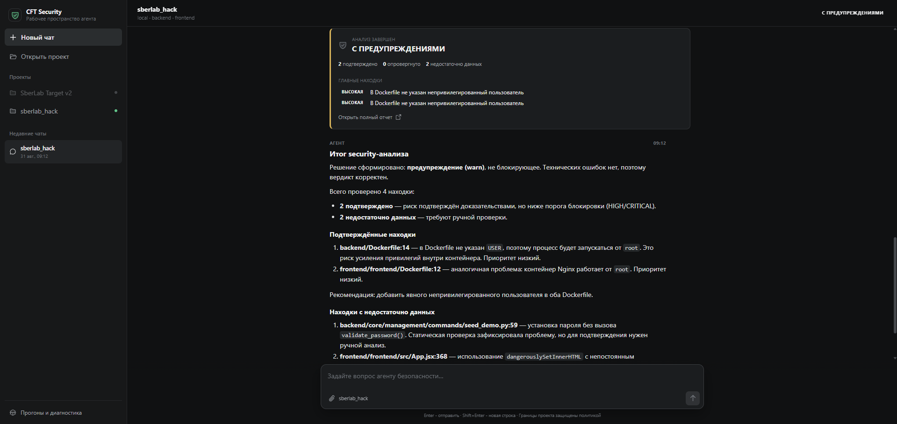

<div align="center">

# CFT Security Agent

### Контекстный анализ и контролируемая проверка уязвимостей в CI/CD

`SAST` · `LangGraph` · `CVSS 4.0` · `Validator` · `Docker Sandbox` · `Evidence` · `CI Gate`

</div>

<p align="center">
  
</p>

<p align="center"><sub>Импорт проекта, live timeline проверки, Evidence и итоговый CI Gate в одном интерфейсе</sub></p>

## О проекте

CFT Security Agent превращает сырые SAST findings в проверяемый результат для разработчика и CI/CD. Система учитывает архитектуру проекта, формирует гипотезу, запускает только разрешенные проверки и связывает итоговый verdict с сохраненным Evidence.

Главный принцип:

> **Агент думает. Validator разрешает. Executor выполняет. Evidence определяет результат.**

На выходе команда получает:

- нормализованные findings из Semgrep;
- CVSS и отдельный Context Priority;
- объяснимую гипотезу и план проверки;
- журнал действий, Evidence и FinalReport;
- детерминированный CI Gate: `PASS`, `WARN` или `FAIL`.

## Архитектура

<p align="center">
  
</p>

Основной pipeline:

```text
Репозиторий
  -> Discovery и TargetProfile
  -> SAST
  -> Context Scoring
  -> Security Agent
  -> Validator
  -> Executor в Docker Sandbox
  -> Evidence
  -> FinalReport
  -> CI Gate
```

`Discovery` строит inventory проекта, а trusted `TargetProfile` фиксирует разрешенный scope, Compose file, services, endpoints и registry артефактов. CVSS показывает техническую серьезность, Context Priority показывает важность finding для конкретной архитектуры. Оценки не смешиваются в одно число.

## Как работает агент

<p align="center">
  
</p>

`AgentState` хранит общий контекст запуска: finding, код, архитектуру, scoring, гипотезу, план, решения Validator, результаты Executor, Evidence и историю итераций. Число шагов и wall time ограничены.

В режиме `stub` reasoning полностью детерминирован. В режиме `llm` используется fallback цепочка провайдеров, но ответы модели проходят Pydantic validation и не обходят policy.

## Границы безопасности

LLM не является границей безопасности. Реальные границы системы:

- каждый `ActionProposal` проходит `Validator`, approval связан с digest полного proposal;
- Executor принимает только зарегистрированные capabilities и trusted artifacts из `TargetProfile`;
- agent не передает произвольные host path, URL или target;
- `sandbox_command` работает только в одноразовом networkless Docker container с read-only target;
- CPU, RAM, PID, размер файлов, output и wall time ограничены;
- `confirmed` и `rejected` требуют подходящий Evidence;
- production access запрещен, технический сбой не маскируется под security verdict.

## Возможности проверки

| Capability | Что проверяет |
|---|---|
| `inspect_dockerfile_user` | Наличие и значение финального `USER` в Dockerfile |
| `inspect_python_password_assignment` | Присвоение пароля и наличие безопасной обработки в Python AST |
| `inspect_react_dangerous_html_flow` | Статический flow данных к опасному HTML sink в React |
| `observe_http_surface` | Разрешенный endpoint активной sandbox session |
| `sandbox_command` | Bounded argv внутри networkless Docker lab |

Успешный exit code capability еще не означает подтвержденную уязвимость. Verdict формируется только из capability-specific Evidence.

## Быстрый запуск

### Требования

- Python `3.11+`;
- Node.js `20.19+`;
- Docker Desktop с Docker Compose для runtime проверок;
- Git.

### Backend и API

```bash
python -m venv .venv
```

Активация окружения:

```bash
# Windows PowerShell
.venv\Scripts\Activate.ps1

# Linux или macOS
source .venv/bin/activate
```

Установка:

```bash
python -m pip install -e ".[dev,sast]"
```

Создайте локальный `.env` из `.env.example`. Для `stub` режима API keys не нужны.

```bash
# Windows
Copy-Item .env.example .env

# Linux или macOS
cp .env.example .env
```

Запуск API:

```bash
cft-security-api
```

API будет доступен на `http://127.0.0.1:8080`, OpenAPI UI на `http://127.0.0.1:8080/docs`.

### Frontend

Во втором терминале:

```bash
cd frontend
npm ci
npm run dev
```

Откройте `http://127.0.0.1:5173`. Через интерфейс можно импортировать папку или ZIP проекта, запустить анализ, наблюдать timeline, раскрывать действия и Evidence, читать FinalReport и задавать вопросы по результатам.

### Live LLM

Для live reasoning укажите ключ в `.env` и переключите режим:

```dotenv
CFT_AGENT_MODE=llm
NSU_OPENWEBUI_KEY=your-local-key
CFT_LLM_TRACE=false
```

По умолчанию система использует NSU route chain. Внешние fallback включаются только явно:

```dotenv
CFT_LLM_ALLOW_EXTERNAL_FALLBACKS=true
```

API keys не попадают в target subprocess и не должны добавляться в Git.

## Запуск из CLI

Полный CI flow для зарегистрированного SberLab target:

```bash
cft-security-ci \
  --target ../sberlab-target \
  --profile targets/sberlab.yaml \
  --output-dir artifacts/security-pipeline \
  --agent-mode stub \
  --max-iterations 1
```

Pipeline выполняет Discovery, поднимает Compose session, запускает SAST, проверяет findings, сохраняет отчеты и вычисляет Gate.

Коды завершения:

| Код | Значение |
|---:|---|
| `0` | Pipeline завершен, Gate не блокирует CI |
| `1` | Pipeline завершен, security или policy результат блокирует CI |
| `2` | Технический сбой pipeline |

Основные артефакты находятся в `artifacts/security-pipeline/`:

```text
discovery.json
target-profile.json
runtime-service-map.json
sast/findings.json
reports/*.json
reports-index.json
evidence/*.json
audit/executor.jsonl
telemetry-index.json
gate.json
ci-summary.json
```

## Проверки проекта

```bash
python -m pytest -q
python -m ruff check .

cd frontend
npm test -- --run
npm run build
```

Integration tests с реальным Docker помечены marker `integration` и могут быть пропущены без доступной lab среды.

## Структура репозитория

```text
cft-security-agent/
├── api/                # FastAPI, очередь запусков и SQLite metadata
├── app/                # CLI и оркестрация pipeline
├── discovery/          # анализ структуры проекта и TargetProfile
├── sast/               # запуск и normalization Semgrep
├── architecture/       # архитектурный контекст
├── scoring/            # CVSS и Context Priority
├── agent/              # LangGraph, reasoning и DynamicPlan
├── validator/          # deterministic policy gate
├── executor/           # capabilities, sandbox и audit
├── evidence/           # Evidence store, telemetry и Evidence Guard
├── reporting/          # FinalReport
├── pipeline/           # Gate, progress, errors и cancellation
├── schemas/            # общие Pydantic contracts
├── frontend/           # React UI
├── targets/            # trusted target profiles
├── policies/           # permission policy
├── docs/               # схемы и скриншоты README
└── tests/              # unit и integration tests
```
